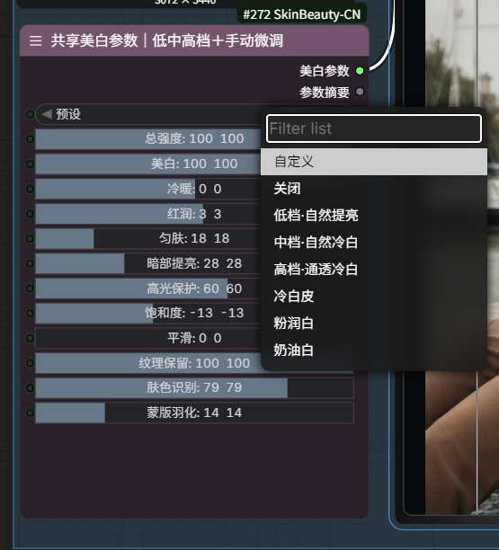
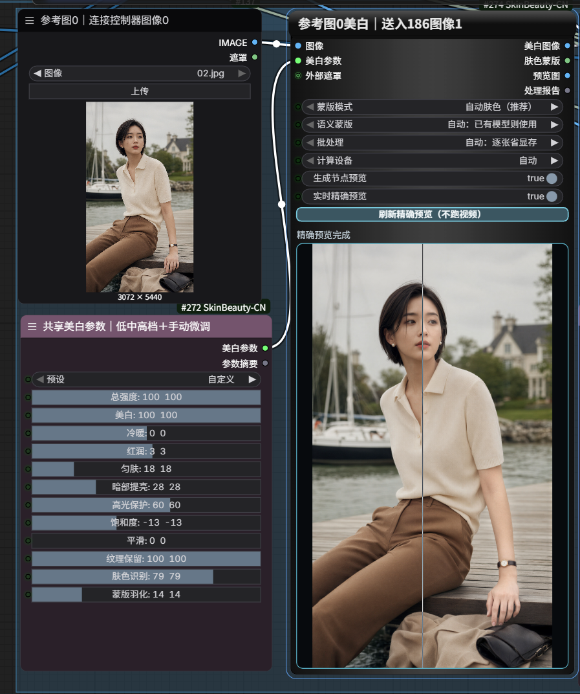
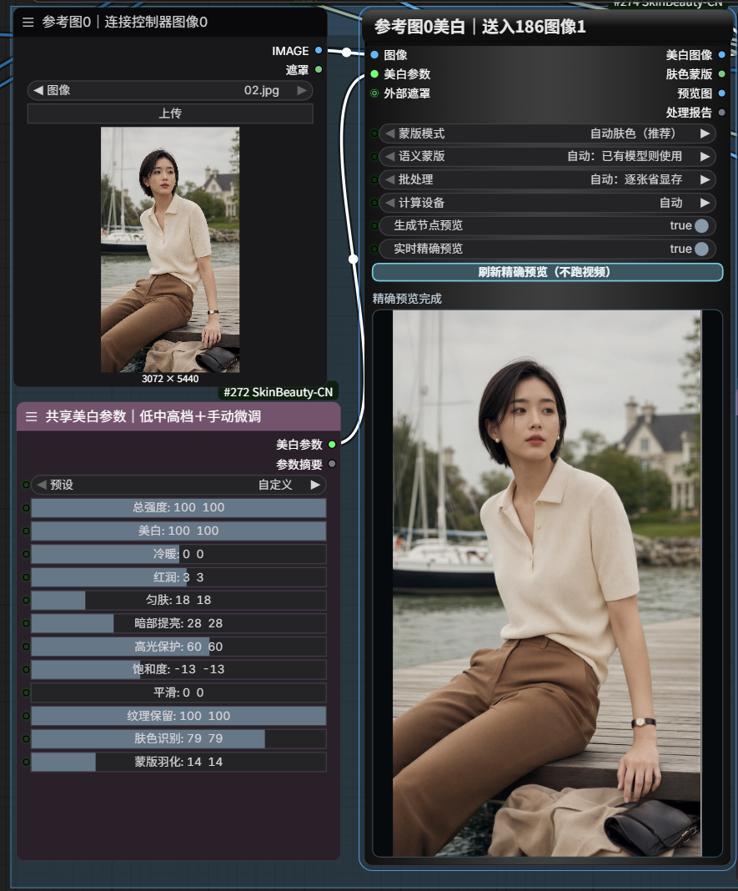
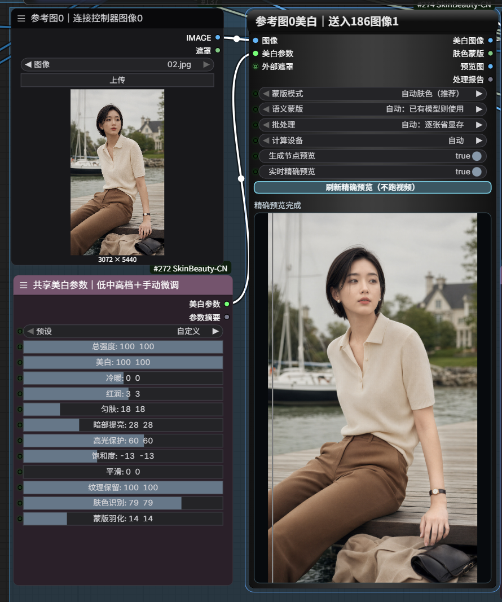

# ComfyUI-SkinBeauty-CN

[中文](README.md) · [Changelog](CHANGELOG.md) · [Security](SECURITY.md) · [Issues](https://github.com/chen-zhang-ai/ComfyUI-SkinBeauty-CN/issues)

ComfyUI nodes for naturally shifting yellow or warm face and body skin toward a cooler, brighter tone while protecting backgrounds, clothing, highlights, and real skin texture.

## Features and advantages

- The core path uses only the PyTorch already provided by ComfyUI: `dependencies = []`, with no automatic package install, upgrade, or removal.
- An adaptive skin mask targets skin instead of whitening the entire frame; an external `MASK` is the highest-precision production path.
- Joint CIELAB lightness, yellow/blue, and red/green correction with shadow lift, highlight protection, evenness, smoothing, and texture preservation.
- Original-resolution exact preview uses ComfyUI's official partial execution and submits only the processor plus required IMAGE, settings, and external-MASK ancestors. Downstream image/video generation, encoding, and save nodes are excluded from exact-preview partial execution. A 1 px line provides the in-node comparison.
- Formal `IMAGE` outputs, including the third preview output, preserve the source resolution. Only the temporary on-screen PNG is resized.
- Same-size batches, memory-saving sequential mode, parallel mode, CPU/GPU selection, and automatic OOM fallback are supported.
- Official `locales/en` and `locales/zh` files plus bilingual custom Canvas controls.
- Optional MediaPipe face/body-skin location hints. Missing packages, models, download errors, or inference errors safely fall back.

Compared with wiring separate mask, grading, smoothing, and preview nodes, this package keeps shared parameters, masking, exact preview, and final processing consistent while reducing dependencies and graph clutter.

## Interface and effect preview





| Divider toward the right: more source image | Divider toward the left: more processed result |
|---|---|
|  |  |

The project owner created these assets or holds publication rights. The custom settings shown are a functional demonstration; results vary with the input, lighting, and mask. Two authorized clips were combined into a silent side-by-side preview. Their motion is not frame-locked, so it must not be read as a scientific pixel comparison: [download the comparison video](https://github.com/chen-zhang-ai/ComfyUI-SkinBeauty-CN/releases/download/v2.2.1/skinbeauty-video-comparison.mp4). Images and video were re-encoded and scanned with no workflow, prompt, local path, or software metadata retained; see [`docs/assets/README.md`](docs/assets/README.md).

## Nodes, presets, and controls

`Skin Beauty Settings` can drive multiple processors. Presets are Off, Low Natural Brightening, Medium Natural Cool White, High Translucent Cool White, Cool White Skin, Rosy White, and Creamy White. Presets remain editable.

Complete controls: preset, intensity, whitening, coolness, rosy tone, evenness, shadow lift, highlight protection, saturation, smoothing, texture preservation, skin detection sensitivity, and mask feathering.

`Skin Beauty Process + Preview` accepts an `IMAGE`, shared settings, and optional `MASK`; it returns the corrected image, skin mask, full-resolution preview image, and bilingual report. It exposes automatic/external/full-image mask modes, semantic modes, batch modes, and device selection.

Exact preview and formal processing share the same full-resolution result; only the node canvas is display-scaled, so downstream `IMAGE` data is unchanged. Automatic refresh uses a 650 ms debounce, single-flight execution, and request sequencing: rapid edits retain only the latest pending request and stale results cannot replace it. Any upstream-generated external `MASK` travels through the required ancestor subgraph into the same production path. External-mask-only mode reports a clear error when no MASK is connected instead of falling back.

## Installation

### ComfyUI Manager / Registry

After the Registry release is available, search for `skin-beauty-cn` or `ComfyUI-SkinBeauty-CN`. If it is not listed yet, use one of the methods below and do not install an unrelated similarly named package.

### Git clone

```bash
cd ComfyUI/custom_nodes
git clone https://github.com/chen-zhang-ai/ComfyUI-SkinBeauty-CN.git
```

### Release ZIP

Download `ComfyUI-SkinBeauty-CN_v2.2.2.zip` from [Releases](https://github.com/chen-zhang-ai/ComfyUI-SkinBeauty-CN/releases), extract it, and verify this layout:

```text
ComfyUI/custom_nodes/ComfyUI-SkinBeauty-CN/__init__.py
```

Restart ComfyUI and press `Ctrl+F5` in the browser. The core path requires no `pip install` command.

## Updating and uninstalling

Back up local modifications, replace the old folder as a whole, restart ComfyUI, and press `Ctrl+F5`; replacing Python only can leave stale JavaScript behind. v2.2.2 preserves node class IDs, Python input keys, internal enum values, and output order for V1/V2.2 workflows.

To uninstall, stop ComfyUI, remove `custom_nodes/ComfyUI-SkinBeauty-CN`, and restart. A model explicitly downloaded by the user remains under `ComfyUI/models/mediapipe/selfie_multiclass_256x256.tflite`; keep or remove it yourself. This project has no uninstall script and never mutates the shared Python environment.

## Workflows

```text
LoadImage --> Skin Beauty Process + Preview --> PreviewImage / downstream
Settings -------------------------------> processor(s)
```

- [`SkinBeauty_Minimal_Pure_Algorithm.json`](workflows/SkinBeauty_Minimal_Pure_Algorithm.json): immediate zero-extra-dependency check.
- [`SkinBeauty_Minimal_Auto_Semantic.json`](workflows/SkinBeauty_Minimal_Auto_Semantic.json): uses local semantic support when present and otherwise falls back without networking.

## Where to place the nodes: common use cases

This project processes ComfyUI `IMAGE` tensors. It does not operate on model weights, accept `LATENT` directly, or read or modify MP4 files directly.

### 1. Correct a reference image before video generation

```text
Reference image / LoadImage → Skin Beauty → image-to-video / reference-video / character-consistency video node
```

Correct skin tone and inspect the exact preview before starting a long video job, rather than discovering an unwanted tone after generation. The node does not compress, resize, or re-encode the reference; its production `IMAGE` output retains the input resolution.

### 2. Final grading after image generation

```text
Image generator → VAE Decode / IMAGE → Skin Beauty → PreviewImage / SaveImage
```

Use it as the final skin-grade step for text-to-image, image-to-image, virtual try-on, inpainting, or outpainting, unifying temperature, brightness, rosy tone, and skin texture before saving. It is not a generator and does not alter weights or prompts. Connect it only after an `IMAGE` exists, never directly to `LATENT`.

### 3. Unify skin tone after upscaling or detail restoration

```text
Image generation → upscale / Face Detailer / restoration → Skin Beauty → SaveImage
```

When upscaling or restoration redraws the face, final skin unification usually belongs afterward. If a video model should receive an already corrected reference, processing can instead happen before a downstream resize. This project adds no image compression.

### 4. Unify multiple character references

```text
Multiple LoadImage nodes → multiple Skin Beauty processors → one shared settings node → multi-reference generator
```

One settings node can drive multiple processors. Use separate processors for differently sized images; same-size images may also form an `IMAGE` batch. Sequential mode is the memory-saving default.

### 5. Precise local grading with an external MASK

```text
IMAGE + reviewed person-skin MASK → Skin Beauty → Preview / Save / downstream model
```

An external `MASK` is the highest-precision path around beige clothing, walls, or complex backgrounds. Prefer a reviewed MASK when only person skin should change. “External mask preferred” uses the MASK when supplied and otherwise returns to automatic skin detection; “External mask only” requires a connected MASK and reports an error if it is missing.

### 6. Grade a batch of decoded video frames

```text
Video decoded to an IMAGE frame batch → Skin Beauty → video combine / encode node
```

The node cannot read or output MP4 directly. Another node must decode video into same-size `IMAGE` frames that satisfy ComfyUI batch rules, and video nodes remain responsible for re-encoding and compression. Frame-by-frame color processing can show slight temporal fluctuation, so test a short clip before a final run. This project does not claim a dedicated temporal-consistency algorithm.

### 7. Photography, portrait finishing, and non-generative grading

```text
LoadImage → Skin Beauty → PreviewImage / SaveImage
```

Ordinary photographs can be shifted from a yellow/warm cast toward natural cool-white skin, gently brightened, or made more consistent. This is not face swapping, generative skin redrawing, or a medical tool.

## Starting point for yellow-to-cool-white correction

Start with Medium Natural Cool White. For strong yellow cast, try coolness 45–65. For brightness only, try whitening 35–55 and coolness 15–35. Raise highlight protection to 75–90 for already bright skin. For pore detail, keep smoothing at or below 15 and texture preservation at 88–96. Reduce skin sensitivity when beige objects are selected; for production, connect a reviewed skin `MASK`.

## Batches, performance, and memory

A ComfyUI `IMAGE` batch requires matching dimensions. Use separate processors sharing one settings node for differently sized references. Sequential processing is the safe default for 3K–5K images. Use parallel mode only for a small same-size batch with known memory headroom. In automatic device mode, a CUDA OOM retries sequentially and then on CPU; explicit GPU mode never silently changes devices.

## Optional MediaPipe: read the risk first

Core skin processing does not require MediaPipe and the project remains `dependencies = []`. If the package or model is absent, or semantic inference fails, the node safely uses its pure-PyTorch skin algorithm. This is not an installation failure. MediaPipe only contributes face/body-skin location hints; it requires neither CUDA nor an NVIDIA GPU, and the model can run on CPU.

### Environment scope and evidence levels

The general baseline in [Google MediaPipe Python Setup](https://developers.google.com/edge/mediapipe/solutions/setup_python) is Python 3.9+, pip 20.3+, and a 64-bit Windows, Linux, or macOS desktop environment. This project's declared scope is narrower: Python 3.10, 3.11, and 3.12 only. Python 3.9 and 3.13 are not claimed as supported. Google's general requirements do not mean that this project physically tested every combination; only the current Windows machine below is labeled “Verified.”

The [PyPI wheels for `mediapipe==0.10.21`](https://pypi.org/project/mediapipe/0.10.21/) cover this project's Python 3.10–3.12 range on 64-bit Windows, macOS 11+ (x86_64 or the corresponding universal2 wheel), and Linux x86_64 (manylinux_2_28). Wheel availability is not the same as project verification. ARM Linux and Raspberry Pi must not be presented as tested here. Consider a pip upgrade only if the active pip is below 20.3 and you have explicitly decided to install MediaPipe.

| Evidence level | Environment or check | Conclusion |
|---|---|---|
| Verified / 实测通过 | Windows 11 64-bit, Python 3.12.10, MediaPipe 0.10.21, RTX 5090, and `selfie_multiclass_256x256.tflite` | `ImageSegmenter` imported, the model loaded, and face-skin plus body-skin semantic masks passed an actual project run |
| CI or mocked / CI 或 Mock 测试 | Python 3.10–3.12 CI and missing-package/model plus download/hash/inference failure fallbacks | Static, contract, packaging, and mocked failures are covered; this is not physical MediaPipe inference on every system |
| Candidate only / 理论候选 | 0.10.13 as a candidate compatibility floor across the project's full Python 3.10–3.12 range | Supported only by wheel availability and likely Tasks API availability; not end-to-end verified |
| Unverified / 未验证 | Other MediaPipe, OS, Python, and hardware combinations | They may work, but this project makes no guarantee |

### MediaPipe version notes

| MediaPipe version | Python package availability | Project verification | Guidance |
|---|---|---|---|
| [0.10.5](https://pypi.org/project/mediapipe/0.10.5/) | PyPI has wheels for Python 3.10/3.11 on some mainstream platforms | No project end-to-end run / Unverified | Historical reference only; not recommended for typical users |
| [0.10.13](https://pypi.org/project/mediapipe/0.10.13/)–0.10.20 | 0.10.13 is the first in this range with mainstream Python 3.12 wheels; exact platform coverage varies by release | No complete model, mask, and ComfyUI integration run / Candidate only | May work, without a compatibility guarantee |
| [0.10.21](https://pypi.org/project/mediapipe/0.10.21/) | Covers this project's Python 3.10–3.12 range | The only version currently verified end to end / Verified | Recommended version |
| Later than 0.10.21 | Newer releases may differ in package layout, dependencies, or API implementation | Unverified | Do not upgrade solely for this node |

Across the project's complete Python 3.10–3.12 range, 0.10.13 is only a **candidate compatibility floor**. It means suitable wheels exist and the required Tasks API may be present; it does not mean the project has passed end-to-end testing. Python 3.10/3.11 may install earlier releases, but that does not make them formally supported. Runtime code does not require the exact version number 0.10.21: another version may work if it supplies the required API, loads the model, and returns the correct result, but it remains unverified.

`mediapipe==0.10.21` is the sole tested recommendation, not a minimum imposed by the TFLite model; the model file itself is not bound to that Python package version. The optional range will not be relaxed to `mediapipe>=0.10.13,<0.10.22`, and 0.10.13 will not be advertised as supported, until real-environment matrix tests cover 0.10.13, 0.10.15, 0.10.18, 0.10.20, and 0.10.21.

### Installation risk and read-only checks

**Do not install MediaPipe unless you need semantic masks.** PyPI metadata for `mediapipe==0.10.21` requires `numpy<2`, `protobuf>=4.25.3,<5`, and `opencv-contrib-python`; installation can also add or change JAX, jaxlib, matplotlib, sentencepiece, sounddevice, flatbuffers, and other indirect dependencies. Several OpenCV distributions—`opencv-python`, `opencv-python-headless`, `opencv-contrib-python`, and `opencv-contrib-python-headless`—can all provide `cv2`, and coexistence can affect unrelated nodes.

First identify the interpreter that actually starts ComfyUI; do not accidentally inspect system Python. These commands only inspect imports and the current dependency state. A successful import does not prove model inference. Replace `<COMFYUI_PYTHON>` with the active interpreter:

```text
<COMFYUI_PYTHON> -c "import sys; print(sys.version)"
<COMFYUI_PYTHON> -m pip show mediapipe
<COMFYUI_PYTHON> -c "import mediapipe as mp; print(mp.__version__); print(mp.tasks.vision.ImageSegmenter)"
<COMFYUI_PYTHON> -m pip check
```

For Windows Portable, run the matching commands from the ComfyUI root and adjust the directory if needed:

```powershell
.\python_embeded\python.exe -c "import sys; print(sys.version)"
.\python_embeded\python.exe -m pip show mediapipe
.\python_embeded\python.exe -c "import mediapipe as mp; print(mp.__version__); print(mp.tasks.vision.ImageSegmenter)"
.\python_embeded\python.exe -m pip check
```

> **Environment-change warning: the following is an optional manual command, not a one-click step for every user.** Back up the environment or use a recoverable, separate ComfyUI installation, then review the planned NumPy, protobuf, OpenCV, and other changes.

```text
<COMFYUI_PYTHON> -m pip install -r custom_nodes/ComfyUI-SkinBeauty-CN/extras/requirements-mediapipe.txt
```

Neither this plugin nor Manager runs pip automatically. The project does not auto-clean or repair OpenCV, uninstall conflicting packages, or force installation with `--no-deps`. Do not upgrade an otherwise working shared environment merely for this node. After a manual install, run `<COMFYUI_PYTHON> -m pip check` again. An installation failure does not prevent the plugin from loading; the semantic path falls back to the pure algorithm.

### Manual MediaPipe model download and placement

Installing the MediaPipe Python package and downloading the TFLite model are independent conditions. A package install does not download this model, and the model does not install the Python package. This repository distributes neither MediaPipe wheels nor the TFLite model.

- Filename: `selfie_multiclass_256x256.tflite`
- Official Google download: [selfie_multiclass_256x256.tflite](https://storage.googleapis.com/mediapipe-models/image_segmenter/selfie_multiclass_256x256/float32/1/selfie_multiclass_256x256.tflite)
- Size: `16,371,837 bytes`
- SHA256: `c6748b1253a99067ef71f7e26ca71096cd449baefa8f101900ea23016507e0e0`
- Final path: `ComfyUI/models/mediapipe/selfie_multiclass_256x256.tflite`

Create the `mediapipe` directory manually if it does not exist, and do not add another same-named nesting level. Semantic masks require all of the following:

1. ComfyUI's active Python can `import mediapipe`;
2. the model exists and its SHA256 is correct;
3. the installed version can create an `ImageSegmenter`;
4. inference returns the [six category masks defined by the Selfie Multiclass model](https://developers.google.com/edge/mediapipe/solutions/vision/image_segmenter);
5. body skin is category index 2 and face skin is category index 3.

Verify on Windows PowerShell:

```powershell
Get-FileHash "ComfyUI\models\mediapipe\selfie_multiclass_256x256.tflite" -Algorithm SHA256
```

Verify on Linux (or macOS with coreutils):

```bash
sha256sum "ComfyUI/models/mediapipe/selfie_multiclass_256x256.tflite"
```

macOS can also use its built-in command:

```bash
shasum -a 256 "ComfyUI/models/mediapipe/selfie_multiclass_256x256.tflite"
```

The default “automatic: use an existing model” mode never downloads. Only the explicit “MediaPipe: allow model download only; never installs Python packages” option retrieves the model from the fixed HTTPS URL; it does not install Python packages. The downloader enforces a 60-second timeout, 32 MiB limit, `.part` file, SHA256 and load validation, and atomic replacement. A missing package/model, bad hash, download error, or inference error safely falls back to the pure algorithm with a sanitized report.

After placing the file, restart ComfyUI, press `Ctrl+F5` in the browser, select “automatic: use an existing model,” and inspect the processing report to confirm whether the run used MediaPipe semantic masks or the pure-algorithm fallback. The model comes from Google MediaPipe and remains subject to the provider's applicable terms. This repository does not distribute it and is not endorsed by Google.

## Privacy and network behavior

Core processing, automatic mode, and local-model inference stay on the machine. There is no telemetry or analytics. Only the explicit model-download mode accesses `https://storage.googleapis.com/mediapipe-models/`. v2.2.2 removes the standalone file-reading preview endpoint: exact preview passes in-memory tensors through ComfyUI's normal queue. Temporary PNGs contain no workflow, prompt, local path, or software metadata and are atomically replaced.

## Known limitations

- Color-based masking can select beige walls, wood, leather, or clothing; an external skin `MASK` is the most accurate path.
- Lighting, color management, and camera white balance change the appearance of the same settings. Presets are starting points, not a universal aesthetic.
- The lightweight MediaPipe model can miss occluded, extreme-pose, distant, or very small people.
- This is controlled tone and texture processing, not generative face replacement or blemish redrawing.
- ComfyUI's global queue remains sequential. Exact preview waits behind an existing long job, but the extension neither piles up concurrent preview jobs nor interrupts unrelated work.

## Compatibility and verification

| Evidence level | Environment | v2.2.2 status |
|---|---|---|
| Verified / 实测通过 | Windows 11 64-bit / Python 3.12.10 / Torch 2.9.1+cu130 / RTX 5090 | Local core path, CPU/GPU comparison, and actual MediaPipe 0.10.21 inference passed |
| CI or mocked / CI 或 Mock 测试 | Windows + Ubuntu / Python 3.10, 3.11, 3.12 | GitHub Actions static, JSON, workflow, security, and packaging matrix; see public CI results |
| CI or mocked / CI 或 Mock 测试 | Ubuntu / Python 3.12 / CPU Torch | GitHub Actions algorithm regression; not a physical MediaPipe test |
| CI or mocked / CI 或 Mock 测试 | Missing MediaPipe/model and download/hash/inference failures | Contract and mocked fallback coverage; not represented as physical tests of every environment |

## Troubleshooting

- Node missing: verify there is no extra nested folder, inspect the startup log, and restart. This project has no root `requirements.txt` or `install.py`.
- Stale language/buttons: check the ComfyUI Locale setting and press `Ctrl+F5`.
- MediaPipe fallback: read the bilingual report. Fallback with no local model is expected and does not break the core node.
- Exact preview connection error: connect both `IMAGE` and the settings node. External-mask modes also require an executable MASK ancestor in the current workflow.
- OOM: use sequential mode, reduce the simultaneous batch, or choose CPU. Do not modify the shared Torch install for this node.

## Attribution, license, and participation

The PyTorch grading pipeline, batching and OOM fallback policies, partial-execution preview orchestration, and Canvas comparer are independently implemented or engineered in this project. YCbCr, sRGB/XYZ/CIELAB, conventional blur/masks, semantic segmentation, and slider comparisons are public techniques; the project does not claim to have invented them and neither copies nor depends on rgthree at runtime. See [`ALGORITHM_AND_ORIGINALITY.md`](docs/ALGORITHM_AND_ORIGINALITY.md), [`ARCHITECTURE.md`](docs/ARCHITECTURE.md), and [`THIRD_PARTY_NOTICES.md`](THIRD_PARTY_NOTICES.md).

Released under the [MIT License](LICENSE). Report vulnerabilities privately as described in [SECURITY.md](SECURITY.md); use GitHub Issues for ordinary bugs. See [CONTRIBUTING.md](CONTRIBUTING.md) and [SUPPORT.md](SUPPORT.md). The project follows SemVer: compatible fixes are patches, features are minors, and intentional protocol breaks require a major version.
